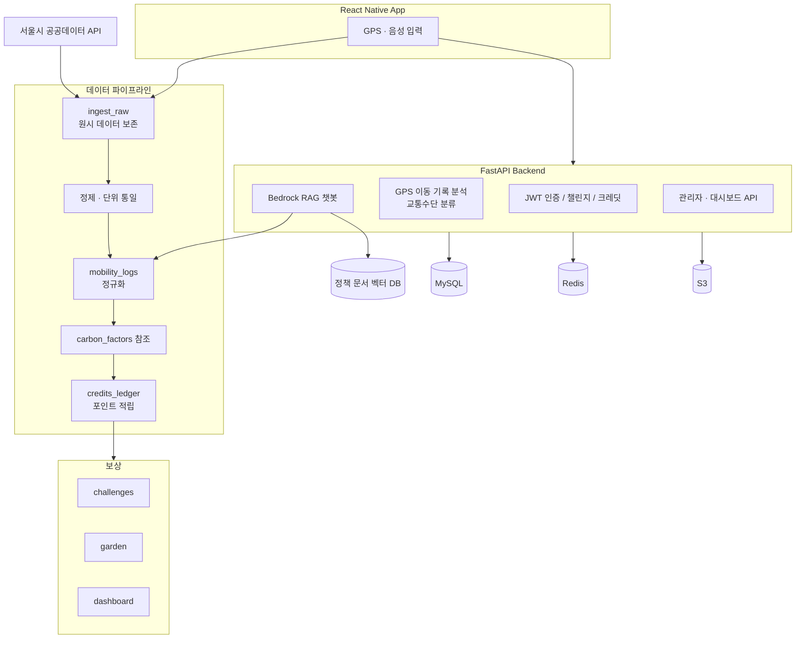

# RePlanet — 서울시 에코마일리지와 함께하는 탄소절감 플랫폼

> GPS·공공데이터로 친환경 이동을 **자동 인식**하고, AWS Bedrock 기반 AI 코칭과 게이미피케이션으로 탄소 절감 행동을 유도하는 플랫폼

[]()
[]()
[]()
[]()

| | |
|---|---|
| **주최** | 서울 AI 재단 × AWS 공동 주관 해커톤 |
| **기간** | 2025.09.08 ~ 2025.09.25 |
| **성과** | **서울 AI재단 이사장상** — 122팀 중 20팀 본선 진출 → 수상 |
| **팀 구성** | Backend 2 · AI 1 |
| **기술 스택** | Python · FastAPI · AWS Bedrock(Claude 3.5 Sonnet) · MySQL · Redis · AWS EC2·RDS·S3 · React Native · scikit-learn · C++ |

<br/>

## 🔧 My Role — 팀장 & Backend & AI/데이터 파이프라인 설계 (@sophie-24)

> ℹ️ 이 저장소는 대회 제출용 원본(`corona3235create-song/seoulAI25_replanet`)에서 포크한 사본입니다. 아래 항목이 제가 직접 설계·구현한 범위입니다.

- **담당 범위** — AWS Bedrock RAG 코칭 챗봇(`bedrock_logic.py`), GPS 이동 데이터 수집·교통수단 분류, 탄소 절감·포인트 데이터 파이프라인, ERD 설계, 관리자·테스트 지원 기능
- **핵심 성과**

| 지표 | 개선 전 | 개선 후 |
|---|---|---|
| GPS 교통수단 분류 정확도 | 60% | **87%** |
| RAG 기반 정책 Q&A 정확도 | 할루시네이션 발생 | **85%** |
| 외부 API 데이터 통합 | 형식 불일치로 저장 불가 | **ETL 표준화 + 원본 추적성 확보** |

<br/>

## 📌 프로젝트 소개

서울시 에코마일리지 제도는 많은 시민이 참여했지만 다음 한계가 있었습니다.

- 수동 활동 기록의 **번거로움**
- **교통 영역 반영 부족**
- 단순 포인트 적립의 **낮은 지속 동기**

RePlanet은 GPS와 공공데이터로 사용자의 이동 수단을 자동 감지하고, 자동차 대비 탄소 절감량을 계산해 **포인트·챌린지·나만의 정원**으로 보상합니다. AI 챗봇은 개인 이동 기록과 서울시 정책 정보를 바탕으로 맞춤형 실천 방법을 제안합니다.

<br/>

## 🏗 Architecture



**설계 의도**

- 수집 원본은 `ingest_raw`에 보존하고 **정제된 결과만** `mobility_logs`에 저장해, `raw_ref_id`로 출처를 역추적할 수 있습니다.
- Redis는 사용자 세션·실시간 랭킹·포인트 조회 캐시에, S3는 정원 스냅샷과 주간 리포트에 사용합니다.

<br/>

## 🧭 기술적 의사결정

### 1. Django 대신 FastAPI

**상황** — GPS 데이터, 공공데이터 API, AWS Bedrock 호출 등 **I/O 작업이 지배적**인 서비스였습니다.

**판단** — AI 응답을 실시간으로 처리하고 확장할 수 있도록 `async/await` 기반 FastAPI를 선택했습니다.

### 2. 원시 데이터와 정제 데이터를 분리하는 ETL 구조

**상황** — 교통카드·따릉이·GPS 데이터는 시간 형식, 거리 단위, 데이터 구조가 모두 달랐습니다.

**판단** — 외부 API 응답을 바로 서비스 테이블에 저장하면 스키마 변경이나 오류 발생 시 **원인 추적이 불가능**합니다. 원본 JSON을 보존하고 출처별 정제 모듈을 거치도록 설계했습니다.

### 3. 단순 속도 규칙 대신 위치 정보 우선 + ML 보조

**상황** — 도시 교통에서는 신호 대기와 정체 때문에 **속도만으로 버스·지하철·자전거·자동차를 구분할 수 없습니다.**

**판단** — 정류장 좌표와 체류 시간을 **우선 신호**로 활용하고, 라벨링 데이터가 충분하지 않은 상황을 고려해 RandomForest 모델은 **보조 신호**로만 사용했습니다.

**결과** — 정확도 60% → 87%. 모델을 주력으로 삼았다면 데이터 부족으로 오히려 불안정했을 것입니다.

<br/>

## 🔍 트러블슈팅

<details>
<summary><b>1. 정책 정보를 잘못 답변하는 AI 챗봇 할루시네이션</b> — RAG 도입 후 정확도 85%</summary>

<br/>

**문제**
에코마일리지 포인트와 서울시 정책을 질문했을 때, LLM이 **실제 규정과 다른 그럴듯한 답변**을 생성했습니다. 공공 정책 안내 서비스에서는 치명적인 결함이었습니다.

**해결**
- 서울시 정책 문서와 공식 PDF를 **벡터 DB에 저장**하고, 질문과 유사한 문서를 검색해 답변 근거로 제공
- Few-shot 예시로 **"문서에 없는 내용은 확인되지 않았다고 답변"**하도록 제약
- 답변에 **참조 문서 출처를 함께 반환**

**결과**
RAG 기반 정책 Q&A **정확도 85%**를 기록했습니다.

**배운 점**
공공 정책처럼 정확성이 중요한 서비스에서는 **LLM 자체 성능보다 신뢰할 수 있는 외부 근거를 연결하고 출처를 함께 제공하는 설계**가 중요하다는 점을 배웠습니다.

</details>

<details>
<summary><b>2. 서로 다른 외부 API 데이터 형식 통합 문제</b></summary>

<br/>

**문제**

| 출처 | 형식 | 시간 표기 |
|---|---|---|
| 교통카드 API | JSON | `YYYY-MM-DD HH:MM` |
| 따릉이 API | XML | `YYYYMMDDHHMM` |
| GPS | 좌표 배열 | timestamp |

형식이 모두 달라 데이터를 그대로 저장할 수 없었습니다.

**해결**
- `ingest_raw` 테이블에 **원시 데이터를 그대로 저장**
- 출처별 Python 정제 모듈에서 시간은 `DATETIME`, 거리는 `km` 단위로 통일
- 정제된 데이터만 `mobility_logs`에 저장하고 `raw_ref_id`로 원본 추적

**배운 점**
외부 데이터 연동에서는 API 호출 자체보다 **데이터 표준화 · 추적 가능성 · 확장성을 고려한 ETL 설계**가 중요합니다.

</details>

<details>
<summary><b>3. GPS 교통수단 분류 정확도 60% 문제</b> — 60% → 87%</summary>

<br/>

**문제**
초기에는 "속도가 30km/h 이상이면 버스"처럼 단순 규칙으로 분류했지만, **교통 상황과 신호 대기** 때문에 실제 정확도가 60% 수준에 머물렀습니다.

**해결**
- 버스·지하철 **정류장 좌표를 DB에 저장**하고, **반경 50m 내 체류 여부**를 대중교통 판정에 반영
- 팀원이 직접 기록·라벨링한 이동 데이터로 **RandomForest 모델을 학습**해 보조 분류 신호로 사용
- 대용량 GPS 로그의 거리 계산·전처리는 **C++**로 수행, Haversine formula로 좌표 간 거리 산출

**결과**
교통수단 분류 정확도 **60% → 87%**를 달성했습니다.

**배운 점**
**모델 선택보다도 실제 환경을 반영한 라벨링 데이터와 도메인 규칙의 결합**이 정확도를 높이는 데 중요했습니다. 데이터가 부족할 때 ML을 주력으로 쓰는 것은 위험합니다.

</details>

<details>
<summary><b>4. Redis 캐시로 인한 포인트 표시 불일치</b></summary>

<br/>

**문제**
GPS 이동으로 포인트가 적립되거나 정원 아이템 구매로 차감될 때, **챌린지·마이페이지·정원 화면에서 이전 포인트가 계속 표시**됐습니다.

**해결**
Cache-Aside 패턴을 적용하고 TTL을 설정했습니다. 포인트 적립·차감 엔드포인트에서 **해당 사용자의 캐시 키를 명시적으로 삭제**하고, 다음 조회에서 DB의 최신 값을 읽어 캐시를 다시 채우도록 구현했습니다.

**배운 점**
캐시는 조회 성능을 높이지만, **쓰기 이후 캐시 무효화 정책을 함께 설계하지 않으면** 사용자에게 데이터 정합성 문제로 보입니다.

</details>

<br/>

## 💡 회고 및 한계

GPS 기반 이동 자동 인식, AWS Bedrock 기반 RAG 챗봇, 탄소 절감 계산, 포인트·정원 보상, 공공데이터 ETL 파이프라인을 End-to-End로 구현했습니다.

**남은 과제**

- DB 인덱스·쿼리 최적화
- 단위·통합 테스트 추가 (해커톤 일정상 미수행)
- 교통 패턴을 반영한 분류 모델 고도화

> 분류 정확도 87%는 **팀원이 직접 라벨링한 데이터 기준**이며, 표본 규모가 크지 않습니다. 일반 사용자 환경에서의 성능은 추가 검증이 필요합니다.

<br/>

## 🚀 실행 방법

```bash
git clone https://github.com/sophie-24/seoul-25-ht-RePlanet.git
cd seoul-25-ht-RePlanet

cp .env.example .env   # AWS_ACCESS_KEY, BEDROCK_REGION, DB_URL, REDIS_URL 설정

pip install -r requirements.txt
uvicorn app.main:app --reload
```

<br/>
